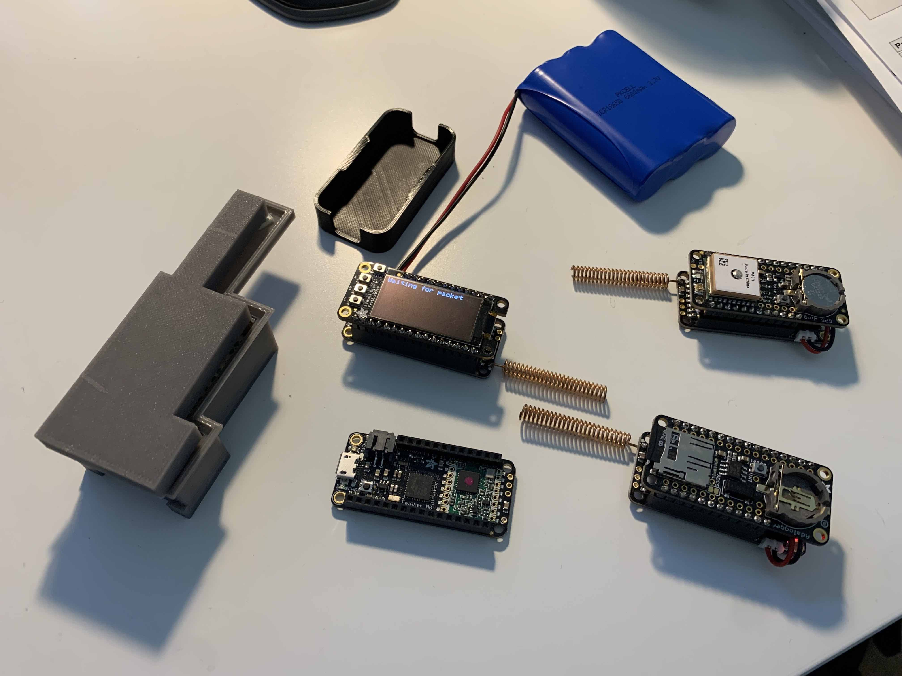

# LoRaHam

This project includes things to communicate data over the 70cm ham radio band using LoRa radios,  inexpensive off-the-shelf hardware, and code examples designed for easy deployment.

This is all entirely built on the wonderful work of Travis Goodspeed (KK4VCZ) located at [loraham.org](https://loraham.org) and [github](https://github.com/travisgoodspeed/loraham/).

# Getting Started

You'll need 

- Two radio boards
- This code
- An amateur radio license

# The Protocol

todo

# Hardware

The current board of choice for these experiments is the Adafruit Feather M0 RFM96 LoRa Radio, specifically in 433MHz/70cm band [available here](https://www.adafruit.com/product/3179).

The above image shows four feather boards, three which have simple coil antennas and featherwings (an OLED screen, a GPS receiver, and an SD logger). Also shown is a large 6600mAh battery and a couple of 3d printed cases. Hidden from view are 400mAh batteries that fit in between the feather & featherwing boards.

Some benefits of using these boards:

- They're entirely compatible with the arduino ecosystem, so writing and loading code is simple
- There are a huge variety of "featherwings" that can be added on top to extend functionality - GPS, SD card, environmental sensors, OLED displays, you name it
- It's really easy to hook up i2c other peripheral devices, especially using i2c via the Stemma/Qwicc connectors (basically, a standardized way of doing i2c supported by Adafruit & [Sparkfun](https://www.sparkfun.com/qwiic))
- The library support is fantastic, they're well documented & typically have a great guide to get up and running
- A wide range of power sources available off the shelf: solar, LiPo batteries from miniscule to fairly large, USB, etc.
- They're easy to design 3D printable cases for; a few already exist for free
- Low power consumption, with a fair ability to tune for very low (although, will never be comparable to purpose-specific hardware obviously)

# Software

todo

# Nodes

- [sd-logger](/sd-logger-node/): A simple node that logs all traffic to SD card in JSON format.

# Experiments

## Battery life

| Node | Battery | Notes | Battery life |
|-------|-------|-----| ---- |
| GPS| 400mAh | Beaconing every 10s |TODO d/h/m/s |
| GPS| 1200mAh | Beaconing every 10s |TODO d/h/m/s |
| SD| 400mAh | Beaconing disabled (RX-only) |TODO d/h/m/s |

## Typical Range

todo

## Solar Power

todo

## GPS Topo mapping

todo