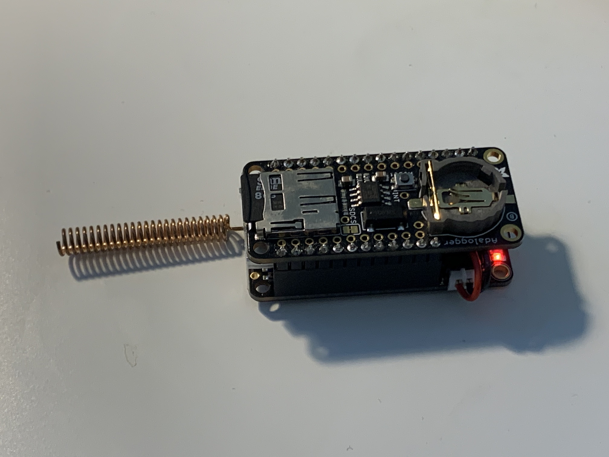

# SD Logger

This example makes use of an SD featherwing to log all packets and some associated metadata to card, in JSON format.

# Hardware

The easiest way to get up and running is with this [Adafruit Ultimate GPS Featherwing](https://www.adafruit.com/product/3133). It features an MTK3333 GPS chip which has a built-in ceramic antenna but can also support an active antenna via UFL connector. It supports a CR1220 coin cell to power a real-time clock which you'll want, to speed up acquisition time.

The above is an [M0 feather](https://www.adafruit.com/product/3179) with the [AdaLogger featherwing](https://www.adafruit.com/product/2922), being powered by a [400mAh LiPo](https://www.adafruit.com/product/3898) tucked inside, and with a [spring antenna](https://www.adafruit.com/product/4394)