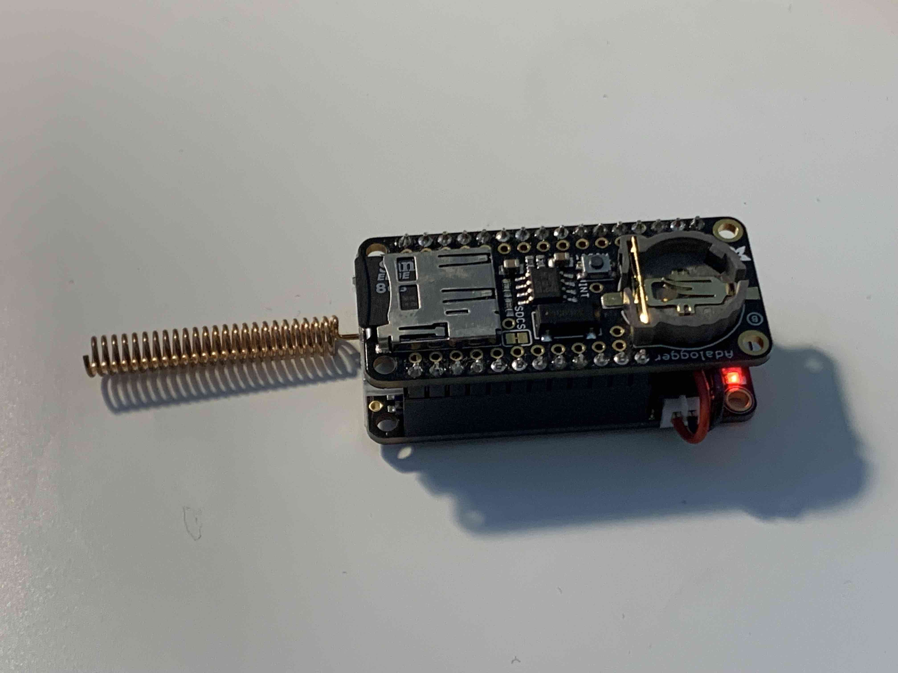

# SD Logger

This example makes use of an SD featherwing to log all packets and some associated metadata to card, in JSON format.

# Hardware

The easiest way to get up and running is with this [Adafruit Ultimate GPS Featherwing](https://www.adafruit.com/product/3133). It features an MTK3333 GPS chip which has a built-in ceramic antenna but can also support an active antenna via UFL connector. It supports a CR1220 coin cell to power a real-time clock which you'll want, to speed up acquisition time.

The above is an [M0 feather](https://www.adafruit.com/product/3179) with the [AdaLogger featherwing](https://www.adafruit.com/product/2922), being powered by a [400mAh LiPo](https://www.adafruit.com/product/3898) tucked inside, and with a [spring antenna](https://www.adafruit.com/product/4394). Cost of parts is approximately $52 not including SD card, which seems reasonable for a long-range mobile data logger.

# Software

The code is pretty simple; a listen loop waits for data to be available on the radio, then disables the radio (the pins are shared) and writes out a line of JSON with the raw packet, as well as the receive signal strength and packet rx/tx (always RX unless you were to add on digipeater functionality.)

And example log, in this case a GPS transmitting LoRaHam beacon node:

`{"packet": "BEACON KD2LYD-44 GPS-TX VCC=3.931 count=154 uptime=1513 gps=4051.628418N,7410.548340W,69.20,8,2 gdate=22-12-13_15:8:18", "direction":"rx", "rssi":"-59"}
`